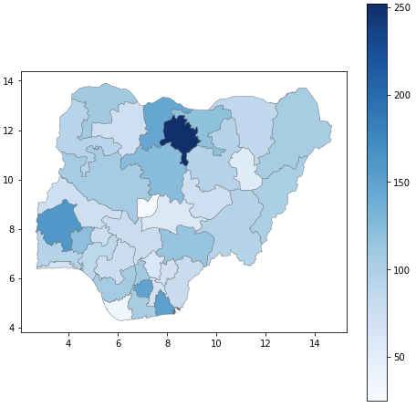
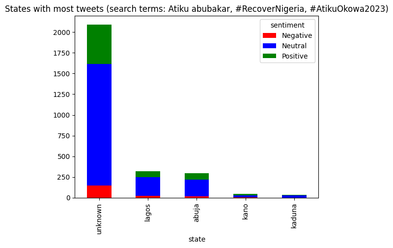
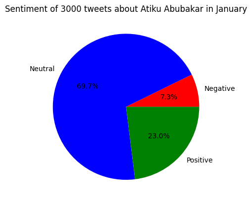

# Nigerian Elections
## Aim
The ultimate goal of this project is to help voters in the upcoming elections decide on a candidate. We do this by creating a website with:
- A summary of each candidates manifesto on key issues such as the economy, education, unemployment, etc.
- Sentiment analysis of social media comments on each candidate (this was limited to twitter as facebook does not have a public API).
- Polling of visitors to our website on issues discussed by each candidate.

## Analysis Output
This repo contains the code required for the sentiment analysis of tweets on the three leading candidates. The initial goal was to create a chloropleth map of the number of tweets and general sentiment of these tweets from different regions in the country. 

This could also have been turned into a product to help candidates identify regions in which they are lagging behind or perceived negatively. They could then take extra steps to correct the situation.

However, it turned out most of the tweets occured in very few locations hence we opted to create a different set of visualisations

 

## Methodolgy
There are 4 pipeline steps to achieve the output files shown above:

### Extract
This step pulls the tweets about a specified candidate from the twitter API. It is possible to specify a date range of tweets to consider.

### Pre-process
As with all natural language analysis it is important to transform the raw text into a shape that fits the model/library that will be used. Moreover, text data is unstructured and often contains unwanted artifacts. Additional information such as the location and candidate the tweet is about is added.

### Sentiment Analysis
Tweets can be classified as positive, negative, or neutral. This is done using a pre-trained model that is specialised in tweets

### Visualisation
Once all the tweets are classified, we can then create the bar and pie charts which will be made uploaded as static images unto the website

## File descriptions
The main files are as follows:
- config.yml: project config file where pipeline steps, number of tweets, candidates and hastags of interest and other configurable variables are specified.
- twitter_pipeline.py: main driver for executing pipeline steps specified in configs. Some steps can be skipped as intermediate results are saved.
- pipelines/twitter/extract_01.py: use tweepy to extract data from API. Save output as a csv.
- pipelines/twitter/preprocess_02.py: clean text data and prepare it for analysis
- pipelines/twitter/sentiment_analysis_03.py: perform sentiment analysis using pretrained model
- pipelines/twitter/visualisation_04.py: create bar chart for specified number of regions and pie charts of all tweets.
- requirements.txt: TODO -> add file with necessary packages and versions

